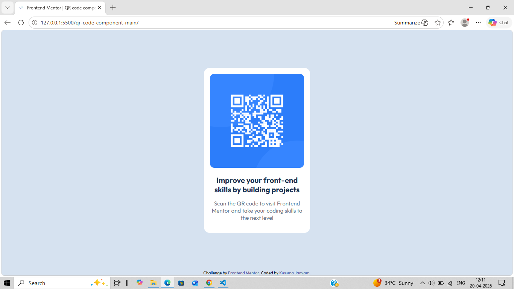

📱 QR Code Card

A simple and responsive QR Code card built using HTML and CSS.
This project helps improve front-end skills by practicing layout, spacing, and styling.

🚀 Live Demo

👉 Add your live project link here (GitHub Pages / Netlify)

👀 Preview

🛠️ Built With
HTML5
CSS3
Flexbox
Google Fonts (Outfit)

✨ Features
Responsive design
Centered card layout
Clean and modern UI
Mobile-friendly

📂 Project Structure
qr-code-component/
│
├── index.html
├── style.css
├── image
     └── image-qr-code.png
├── README.md

📚 What I Learned 
How to center elements using Flexbox
Creating card layouts
Working with images and text alignment
Improving UI design skills

🧠 Continued Development
Add hover effects and animations
Improve accessibility
Make the design more pixel-perfect

🙌 Acknowledgements
Design inspired by Frontend Mentor
Thanks to the community for learning resources

👩‍💻 Author

Kusuma Jamjam 

GitHub: https://github.com/JamjamKusuma16 
LinkedIn: https://www.linkedin.com/in/kusuma-jamjam-771380258/
⭐ If you like this project, feel free to give it a star!
